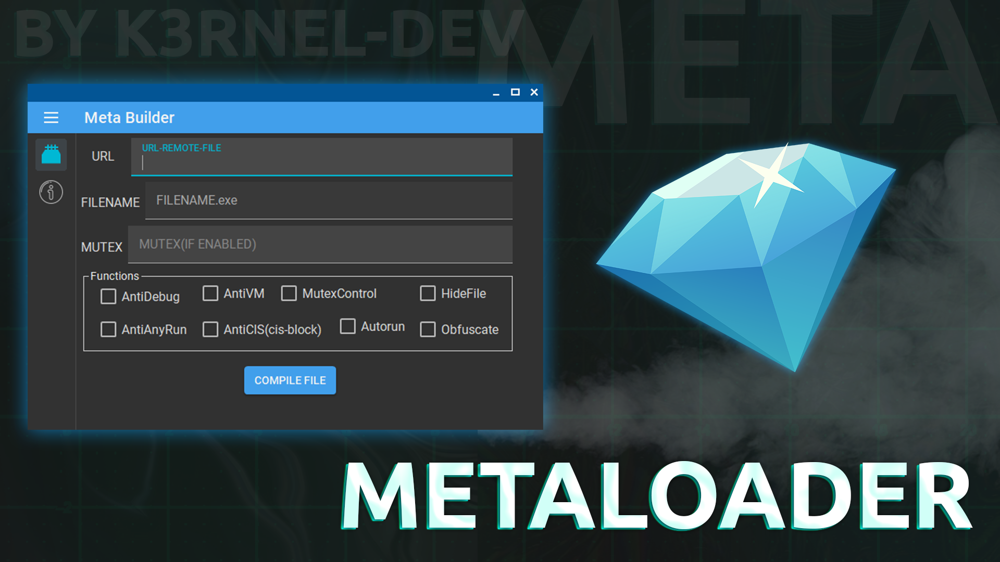

# MetaLoader



## 📑 About
```
Loader on your PE-files. Have builder and more functions.
Using Libs: dnlib, MaterialSkin v2.
```
### 💾 Features:
 * Build Size: 15-16kb✅
 * Self-Delete after execute file:✅
 * Mutex-Control:✅
 * AntiDebug(simple):✅
 * Anti-AnyRun(win7):✅
 * Anti-VM:✅
 * Anti-CIS:✅
 * Autorun:✅
 * HideFile:✅
 * Obfuscator(rename-funcs):✅

## 💻 Screens
<p float="left">
  
</p> 

## ⚠️ Disclaimer
```
This open-source loader is provided for educational purposes only. 
The author assumes no responsibility for any misuse or illegal activities performed with this software.
Users are solely responsible for ensuring that their use of this tool complies with all applicable laws and regulations.
```

## ✨ End
<strong>Thanks for watching this repository!</strong>